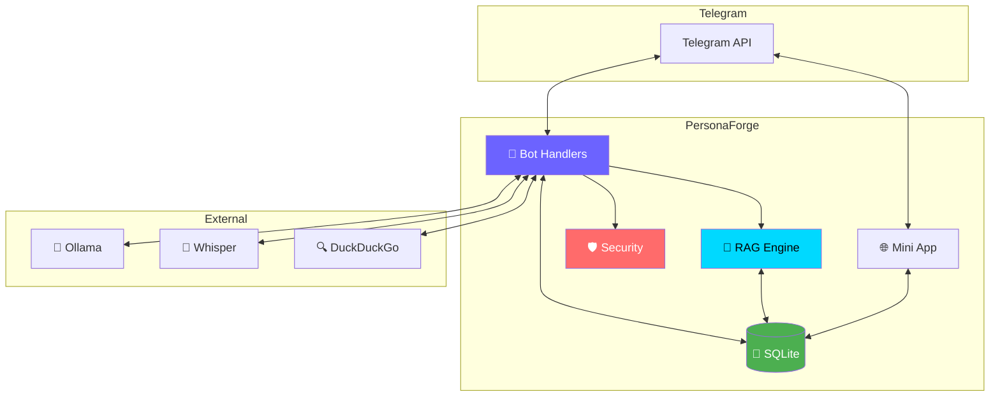

<div align="center">

<!-- ANIMATED HEADER -->


<!-- TYPING ANIMATION -->
<a href="https://git.io/typing-svg"></a>

<!-- BADGES ROW 1 -->
<p>
<a href="https://github.com/bobberdolle1/PersonaForge/actions/workflows/ci.yml"></a>
<a href="https://github.com/bobberdolle1/PersonaForge/releases"></a>
<a href="https://github.com/bobberdolle1/PersonaForge/blob/main/LICENSE"></a>
</p>

<!-- BADGES ROW 2 -->
<p>


</p>

<!-- STATS -->
<p>


</p>

<!-- QUICK LINKS -->
<p>
<a href="https://github.com/bobberdolle1/PersonaForge/wiki"></a>
<a href="https://github.com/bobberdolle1/PersonaForge/issues/new?template=bug_report.md"></a>
<a href="https://github.com/bobberdolle1/PersonaForge/issues/new?template=feature_request.md"></a>
<a href="https://github.com/bobberdolle1/PersonaForge/discussions"></a>
</p>

</div>

<!-- DEMO GIF -->
<div align="center">
<br>

<br><br>
</div>

---


<!-- FEATURES SECTION -->
##  Features

<table>
<tr>
<td width="50%">

### 🎭 AI Personas
Create unique AI personalities with custom prompts, display names, and trigger keywords. Switch between personas on the fly.

```json
{
  "name": "Philosopher",
  "display_name": "Сократ",
  "triggers": "философия,смысл,почему",
  "prompt": "Ты — Сократ..."
}
```

</td>
<td width="50%">

### 🧠 RAG Memory
Vector-based conversation memory with time-decay weighting. The bot remembers context and uses relevant information.

```
score = similarity × e^(-decay × hours/24)
```

</td>
</tr>
<tr>
<td width="50%">

### 🎤 Voice Messages
Whisper-powered voice transcription. Send voice messages and get intelligent responses through your active persona.

</td>
<td width="50%">

### 👁️ Vision & Media
Analyze images, GIFs (3-frame extraction), and video messages. Multimodal understanding through LLaVA/BakLLaVA.

</td>
</tr>
<tr>
<td width="50%">

### 🌐 Web Search
DuckDuckGo integration for real-time information. No API keys required — privacy-focused search.

</td>
<td width="50%">

### 🛡️ Security
40+ prompt injection patterns detection, strike system, adaptive rate limiting, and automatic blocking.

</td>
</tr>
</table>

---


<!-- QUICK START -->
##  Quick Start

<details>
<summary><b>📋 Prerequisites</b></summary>
<br>

- [Rust](https://rustup.rs/) 1.70+
- [Ollama](https://ollama.ai/) with models
- Telegram Bot Token from [@BotFather](https://t.me/BotFather)

</details>

### ⚡ One-liner Install

```bash
git clone https://github.com/bobberdolle1/PersonaForge.git && cd PersonaForge && cp .env.example .env
```

### 🔧 Configure

```env
TELOXIDE_TOKEN=your_bot_token_here
OWNER_ID=your_telegram_id
DATABASE_URL=sqlite:persona_forge.db
OLLAMA_CHAT_MODEL=llama3.2
```

### 🚀 Run

<table>
<tr>
<td>

**Cargo**
```bash
cargo run --release
```

</td>
<td>

**Docker**
```bash
docker-compose up --build
```

</td>
</tr>
</table>

---


<!-- ARCHITECTURE -->
##  Architecture



<details>
<summary><b>📁 Project Structure</b></summary>

```
src/
├── main.rs              # Entry point, dispatcher setup
├── config.rs            # Environment configuration
├── state.rs             # Shared state (AppState)
├── logging.rs           # Colored logging system
│
├── bot/handlers/
│   ├── commands.rs      # /menu, /status, /create_persona...
│   ├── messages.rs      # Message processing, RAG retrieval
│   └── callbacks.rs     # Inline keyboard handlers
│
├── db/                  # SQLx queries
├── llm/                 # Ollama client
├── security/            # Prompt injection protection
├── voice/               # Whisper integration
├── web/                 # DuckDuckGo search
└── webapp/              # Mini App (Axum + embedded frontend)
```

</details>

---


<!-- COMMANDS -->
##  Commands

<div align="center">

| Command | Description |
|:--------|:------------|
| `/menu` | 🎛️ Interactive main menu |
| `/status` | 📊 System status (Ollama, DB, queue) |
| `/create_persona name\|prompt` | 🎭 Create new persona |
| `/list_personas` | 📋 List all personas |
| `/activate_persona ID` | ✅ Activate persona |
| `/set_model name` | 🧠 Change LLM model |
| `/set_temperature 0.7` | 🌡️ Set temperature |
| `/triggers word1, word2` | 🎯 Set trigger keywords |
| `/enable_rag` / `/disable_rag` | 🧠 Toggle RAG memory |
| `/block user_id [min]` | 🚫 Block user |
| `/whoami` | 👤 What bot knows about you |

</div>

---


<!-- MINI APP -->
##  Mini App

<div align="center">
<table>
<tr>
<td align="center"><b>📊 Status</b><br><sub>Real-time monitoring</sub></td>
<td align="center"><b>🎭 Personas</b><br><sub>Create & manage</sub></td>
<td align="center"><b>💬 Chats</b><br><sub>Settings per chat</sub></td>
<td align="center"><b>🛡️ Security</b><br><sub>Block & monitor</sub></td>
<td align="center"><b>⚙️ Config</b><br><sub>Runtime settings</sub></td>
</tr>
</table>
</div>

<details>
<summary><b>🔧 Setup Mini App</b></summary>

1. **Start HTTPS tunnel:**
```bash
ssh -R 80:localhost:8080 serveo.net
# or: ngrok http 8080
```

2. **Create in @BotFather:**
```
/newapp → Select bot → Name: PersonaForge Panel → URL: https://your-url.com
```

3. **Add menu button:**
```
/setmenubutton → Select bot → web_app → 🎛️ Panel → URL
```

</details>

---


<!-- CONFIGURATION -->
##  Configuration

<details>
<summary><b>📝 Full .env Example</b></summary>

```env
# ═══════════════════════════════════════════════════════════════
# 🤖 TELEGRAM
# ═══════════════════════════════════════════════════════════════
TELOXIDE_TOKEN=your_bot_token
OWNER_ID=123456789

# ═══════════════════════════════════════════════════════════════
# 💾 DATABASE
# ═══════════════════════════════════════════════════════════════
DATABASE_URL=sqlite:persona_forge.db

# ═══════════════════════════════════════════════════════════════
# 🦙 OLLAMA
# ═══════════════════════════════════════════════════════════════
OLLAMA_URL=http://localhost:11434
OLLAMA_CHAT_MODEL=llama3.2
OLLAMA_EMBEDDING_MODEL=nomic-embed-text
OLLAMA_VISION_MODEL=llava

# ═══════════════════════════════════════════════════════════════
# ⚡ GENERATION
# ═══════════════════════════════════════════════════════════════
TEMPERATURE=0.7
MAX_TOKENS=2048
LLM_TIMEOUT_SECONDS=120

# ═══════════════════════════════════════════════════════════════
# 🎛️ FEATURES
# ═══════════════════════════════════════════════════════════════
VISION_ENABLED=true
VOICE_ENABLED=true
WEB_SEARCH_ENABLED=true

# ═══════════════════════════════════════════════════════════════
# 🎤 WHISPER
# ═══════════════════════════════════════════════════════════════
WHISPER_URL=http://localhost:8080/inference

# ═══════════════════════════════════════════════════════════════
# 🧠 RAG
# ═══════════════════════════════════════════════════════════════
RAG_DECAY_RATE=0.1
SUMMARY_THRESHOLD=50

# ═══════════════════════════════════════════════════════════════
# 📊 QUEUE
# ═══════════════════════════════════════════════════════════════
MAX_CONCURRENT_LLM_REQUESTS=3
QUEUE_TIMEOUT_SECONDS=30

# ═══════════════════════════════════════════════════════════════
# 🌐 WEBAPP
# ═══════════════════════════════════════════════════════════════
WEBAPP_PORT=8080
```

</details>

---


<!-- PERSONAS EXAMPLES -->
##  Persona Examples

<table>
<tr>
<td>

**🧙 Philosopher**
```json
{
  "name": "Сократ",
  "triggers": "философия,смысл",
  "prompt": "Ты — Сократ. Отвечаешь вопросами, подводя к истине."
}
```

</td>
<td>

**🤖 Tech Expert**
```json
{
  "name": "Техник",
  "triggers": "код,баг,ошибка",
  "prompt": "Ты — senior разработчик. Даёшь чёткие ответы с примерами кода."
}
```

</td>
</tr>
<tr>
<td>

**🎬 Character**
```json
{
  "name": "Чувак",
  "triggers": "dude,боулинг",
  "prompt": "Ты — The Dude из 'Большой Лебовски'. Расслабленный философ."
}
```

</td>
<td>

**👋 Friend**
```json
{
  "name": "Бро",
  "triggers": "бро,друг",
  "prompt": "Ты — лучший друг. Поддерживаешь, шутишь, общаешься неформально."
}
```

</td>
</tr>
</table>

---


<!-- TECH STACK -->
##  Tech Stack

<div align="center">

| Category | Technologies |
|:--------:|:-------------|
| **Language** |   |
| **Bot** |  |
| **Web** |  |
| **Database** |   |
| **AI** |   |
| **Search** |  |
| **Deploy** |   |

</div>

---


<!-- LOGGING -->
##  Beautiful Logging

```
╔══════════════════════════════════════════════════════════════╗
║   ██████╗ ███████╗██████╗ ███████╗ ██████╗ ███╗   ██╗ █████╗ ║
║   ██╔══██╗██╔════╝██╔══██╗██╔════╝██╔═══██╗████╗  ██║██╔══██╗║
║   ██████╔╝█████╗  ██████╔╝███████╗██║   ██║██╔██╗ ██║███████║║
║   ██╔═══╝ ██╔══╝  ██╔══██╗╚════██║██║   ██║██║╚██╗██║██╔══██║║
║   ██║     ███████╗██║  ██║███████║╚██████╔╝██║ ╚████║██║  ██║║
║   ╚═╝     ╚══════╝╚═╝  ╚═╝╚══════╝ ╚═════╝ ╚═╝  ╚═══╝╚═╝  ╚═╝║
║              🤖 F O R G E   v1.0.0                           ║
╚══════════════════════════════════════════════════════════════╝

┌─ Configuration ─────────────────────────────────────────────┐
│  🤖  Bot Name    │ PersonaForge                             │
│  🧠  LLM Model   │ llama3.2                                 │
│  ✓   Vision      │ Enabled                                  │
└──────────────────────────────────────────────────────────────┘

✓  Database connected: sqlite:persona_forge.db
✓  Bot identity: MyBot (@my_bot)
✓  WebApp listening on port 8080

🚀  PersonaForge is ready and listening!

12:34:56 INF [messages] 💬 User in -123456: "Привет!"
12:34:57 INF [llm] 🧠 Response in 1234ms (156 chars)
```

---


<!-- CONTRIBUTING -->
##  Contributing

<div align="center">

Contributions are welcome! 🎉

[](https://github.com/bobberdolle1/PersonaForge/pulls)

</div>

1. Fork the repository
2. Create your branch: `git checkout -b feature/amazing-feature`
3. Commit changes: `git commit -m 'feat: add amazing feature'`
4. Push: `git push origin feature/amazing-feature`
5. Open a Pull Request

<details>
<summary><b>📋 Before submitting</b></summary>

```bash
cargo fmt          # Format code
cargo clippy       # Lint
cargo test         # Run tests
cargo audit        # Security check
```

</details>

---


<!-- FOOTER -->
##  Support

<div align="center">

If you like this project, please give it a ⭐!

[](https://star-history.com/#bobberdolle1/PersonaForge&Date)

</div>

---

<div align="center">

### 📜 License

This project is licensed under the [MIT License](LICENSE)

---

<sub>Made with 🦀 Rust and ❤️</sub>


</div>
