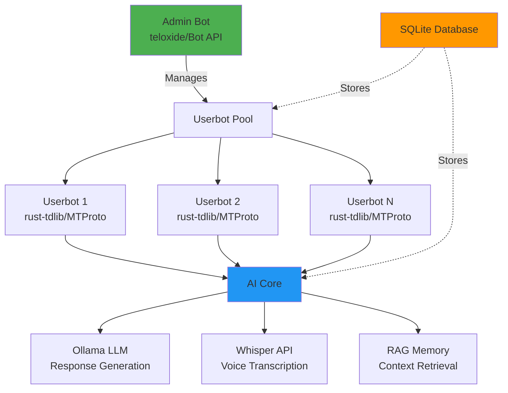

# Puppeteer 🎭

[](https://www.rust-lang.org/)
[](LICENSE)
[](https://github.com/yourusername/puppeteer/actions)
[](docker-compose.yml)

**Multi-account Telegram userbot orchestration system powered by AI for human-like interactions.**

Puppeteer is a sophisticated Telegram automation framework that manages multiple MTProto userbot accounts, each driven by customizable AI personalities. Built with Rust for performance and reliability, it simulates natural human behavior patterns while providing advanced features like RAG memory, voice transcription, and intelligent response generation.

## 🏗️ Architecture



## ✨ Features

- **🤖 Multi-Account Management**: Orchestrate unlimited Telegram userbot accounts from a single admin interface
- **🧠 AI-Driven Responses**: Powered by Ollama with customizable system prompts per account
- **👤 Humanization Engine**: 
  - Configurable reply probability (0-100%)
  - Read delays based on message length
  - Typing indicators with realistic timing
  - Natural conversation flow
- **💾 RAG Memory System**: Long-term conversation memory with vector embeddings
- **🎤 Voice Transcription**: Automatic voice message transcription via Whisper API
- **🖼️ Vision Support**: Image analysis through multimodal LLM models
- **🔒 Security Features**:
  - Prompt injection detection
  - Strike system for abuse prevention
  - Rate limiting
  - Owner-only admin commands
- **📊 Database**: SQLite with WAL mode for high concurrency
- **🐳 Docker Ready**: Complete containerization with docker-compose

## 🛠️ Tech Stack

- **Language**: Rust (Edition 2021)
- **Async Runtime**: Tokio
- **Admin Bot**: teloxide (Telegram Bot API)
- **Userbots**: rust-tdlib (Telegram MTProto)
- **Database**: SQLx + SQLite
- **AI/ML**: Ollama (LLM), Whisper (Speech-to-Text)
- **HTTP Client**: reqwest
- **Serialization**: serde + serde_json

## 🚀 Quick Start

### Prerequisites

- Docker & Docker Compose
- Telegram API credentials ([obtain here](https://my.telegram.org/apps))
- Telegram Bot Token ([create via @BotFather](https://t.me/botfather))
- Ollama instance (for AI responses)

### Setup

1. **Clone the repository**:
```bash
git clone https://github.com/yourusername/puppeteer.git
cd puppeteer
```

2. **Configure environment**:
```bash
cp .env.example .env
# Edit .env with your credentials
```

Required environment variables:
```env
# Telegram Bot API
BOT_TOKEN=your_bot_token_here
OWNER_IDS=123456789,987654321  # Comma-separated admin user IDs

# Telegram MTProto API
TELEGRAM_API_ID=your_api_id
TELEGRAM_API_HASH=your_api_hash

# Database
DATABASE_URL=sqlite:data/puppeteer.db

# AI Services
OLLAMA_URL=http://localhost:11434
OLLAMA_MODEL=llama2
WHISPER_URL=http://localhost:9000  # Optional
```

3. **Start with Docker Compose**:
```bash
docker-compose up --build
```

4. **Add your first userbot**:
- Send `/add_account` to your admin bot
- Follow the authentication flow (phone → code → 2FA if enabled)
- The userbot will start automatically

### Manual Build (without Docker)

```bash
# Install Rust
curl --proto '=https' --tlsv1.2 -sSf https://sh.rustup.rs | sh

# Install TDLib dependencies (Ubuntu/Debian)
sudo apt-get install -y build-essential cmake gperf libssl-dev zlib1g-dev

# Build
cargo build --release

# Run
./target/release/puppeteer
```

## 📖 Usage

### Admin Commands

- `/add_account` - Add a new userbot account
- `/list_accounts` - List all registered accounts
- `/start_account <id>` - Start a specific userbot
- `/stop_account <id>` - Stop a specific userbot
- `/set_prompt <id>` - Update system prompt for an account
- `/set_probability <id> <0-100>` - Set reply probability
- `/whitelist_chat <id> <chat_id>` - Allow userbot to respond in a chat
- `/status` - Show system status
- `/help` - Display all commands

### System Prompt Customization

Each userbot can have a unique AI personality defined by its system prompt. The default prompt uses a Russian casual conversation style with positive framing and roleplay techniques.

Example custom prompt:
```
You are a tech enthusiast who loves discussing programming and AI.
Keep responses concise and use technical terminology when appropriate.
Show genuine curiosity about new technologies.
```

## 🗂️ Project Structure

```
puppeteer/
├── src/
│   ├── main.rs              # Entry point
│   ├── config.rs            # Configuration management
│   ├── state.rs             # Application state
│   ├── bot/                 # Admin bot (teloxide)
│   │   ├── mod.rs
│   │   ├── handlers.rs      # Command handlers
│   │   ├── dialogues.rs     # Authentication flows
│   │   └── middleware.rs    # Owner verification
│   ├── userbot/             # MTProto userbots
│   │   ├── mod.rs
│   │   └── worker.rs        # Event loop & message handling
│   ├── ai/                  # AI integrations
│   │   ├── mod.rs
│   │   ├── ollama.rs        # LLM client
│   │   └── whisper.rs       # Voice transcription
│   └── db/                  # Database layer
│       ├── mod.rs
│       ├── models.rs        # Data models
│       └── repository.rs    # Database operations
├── migrations/              # SQLx migrations
├── data/                    # SQLite database & TDLib sessions
├── Dockerfile
├── docker-compose.yml
└── Cargo.toml
```

## 🔧 Configuration

### Reply Probability

Control how often a userbot responds to messages (0-100%):
```bash
/set_probability 1 75  # 75% chance to reply
```

### Chat Whitelisting

Restrict userbots to specific chats:
```sql
INSERT INTO chat_whitelist (account_id, chat_id) VALUES (1, -1001234567890);
```

### Humanization Tuning

Adjust timing in `src/userbot/worker.rs`:
- `calculate_read_delay()`: Simulates reading time
- `calculate_typing_delay()`: Simulates typing speed

## 🤝 Contributing

Contributions are welcome! Please feel free to submit a Pull Request.

1. Fork the repository
2. Create your feature branch (`git checkout -b feature/amazing-feature`)
3. Commit your changes (`git commit -m 'Add amazing feature'`)
4. Push to the branch (`git push origin feature/amazing-feature`)
5. Open a Pull Request

## 📝 License

This project is licensed under the MIT License - see the [LICENSE](LICENSE) file for details.

## ⚠️ Disclaimer

This software is provided for educational and research purposes only. Users are responsible for complying with Telegram's Terms of Service and applicable laws. The authors are not responsible for any misuse of this software.

**Important Notes**:
- Using userbots may violate Telegram's ToS
- Automated messaging can result in account restrictions
- Always respect rate limits and user privacy
- Use responsibly and ethically

## 🙏 Acknowledgments

- [teloxide](https://github.com/teloxide/teloxide) - Telegram Bot framework
- [rust-tdlib](https://github.com/antonio-antuan/rust-tdlib) - TDLib Rust wrapper
- [Ollama](https://ollama.ai/) - Local LLM inference
- [Whisper](https://github.com/openai/whisper) - Speech recognition

## 📧 Support

For questions and support:
- Open an [issue](https://github.com/yourusername/puppeteer/issues)
- Check existing [discussions](https://github.com/yourusername/puppeteer/discussions)

---

**Made with ❤️ and Rust 🦀**
