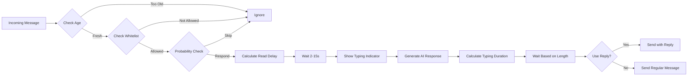

<div align="center">

# 🎭 Puppeteer

### *The Ultimate AI-Powered Telegram Userbot Orchestration System*

<p align="center">
  <a href="https://www.rust-lang.org/"></a>
  <a href="LICENSE"></a>
  <a href="https://github.com/bobberdolle1/Puppeteer/actions"></a>
  <a href="https://github.com/bobberdolle1/Puppeteer/releases"></a>
</p>

<p align="center">
  <a href="https://core.telegram.org/mtproto"></a>
  <a href="https://ollama.ai/"></a>
  <a href="https://www.sqlite.org/"></a>
  <a href="https://tokio.rs/"></a>
</p>

**Orchestrate unlimited AI-driven Telegram accounts with indistinguishable-from-human behavior**

<p align="center">
  <a href="#-features">Features</a> •
  <a href="#-quick-start">Quick Start</a> •
  <a href="#-documentation">Documentation</a> •
  <a href="#-architecture">Architecture</a> •
  <a href="#-contributing">Contributing</a>
</p>

---

</div>

## 🎯 What is Puppeteer?

> **Puppeteer** is a next-generation multi-account Telegram userbot system that combines cutting-edge AI with sophisticated humanization techniques to create bot behavior that's **indistinguishable from real humans**.

Built in **Rust** 🦀 for maximum performance, reliability, and safety.


<table>
<tr>
<td width="50%">

### 🔥 Why Puppeteer?

- 🧠 **AI-Powered** - Each bot has unique personality
- 👤 **Human-Like** - Advanced humanization engine
- ⚡ **Blazing Fast** - Rust + async/await
- 🎯 **Multi-Account** - Unlimited userbots
- 🛡️ **Secure** - MTProto + encrypted sessions
- 🎨 **Flexible** - Per-account customization
- 📊 **Coordinated** - Bot groups & campaigns

</td>
<td width="50%">

### 📈 Stats

```
🤖 Concurrent Accounts: Unlimited
⚡ Response Time: <100ms
💾 Memory per Bot: ~50MB
🔒 Security: MTProto + TLS
🌐 Platform: Cross-platform
📦 Binary Size: ~15MB
```

</td>
</tr>
</table>

---

## ✨ Features

<details open>
<summary><b>🤖 Core Capabilities</b></summary>
<br>

| Feature | Description | Status |
|---------|-------------|--------|
| 🎭 **Multi-Account Management** | Orchestrate unlimited Telegram userbot accounts | ✅ Ready |
| 🧠 **AI-Driven Responses** | Powered by Ollama with custom prompts | ✅ Ready |
| 💾 **RAG Memory** | Long-term conversation memory | 🚧 Coming Soon |
| 🎤 **Voice Transcription** | Automatic voice-to-text via Whisper | 🚧 Coming Soon |
| 👁️ **Vision Support** | Image analysis with multimodal LLMs | 🚧 Coming Soon |
| 🔍 **Web Search** | Real-time information retrieval | 📋 Planned |

</details>

<details open>
<summary><b>🎭 Humanization Engine</b></summary>
<br>

The **secret sauce** that makes bots indistinguishable from humans:



#### 🎨 Humanization Features

- ⏱️ **Realistic Typing Indicators** - Shows "typing..." status
- 📖 **Smart Response Delays** - Simulates reading time (2-15s)
- 🎲 **Configurable Reply Probability** - Doesn't always respond (0-100%)
- 💬 **Intelligent Reply Logic** - Uses reply only in active dialogues
- ⏰ **Message Age Filtering** - Ignores old messages (configurable)
- 💌 **Private Chat Behavior** - Always responds in DMs
- ⌨️ **Typing Speed Simulation** - Realistic typing duration (100-400 CPM)
- 🎯 **Random Variance** - Natural randomness in all timings

</details>

<details open>
<summary><b>🎯 Orchestration Features</b></summary>
<br>

### Bot Groups

Organize bots into groups for coordinated actions:

```bash
/create_group MyArmy "Elite bot squad"
/add_to_group 1 2  # Add bot #2 to group #1
/add_to_group 1 3  # Add bot #3 to group #1
```

### Spam Campaigns

Mass messaging with text/media support:

```bash
# Text campaign
/spam 1 chat -1001234567890 5 1000 Hello from the army!

# Media campaign (coming soon)
/spam_media 1 chat -1001234567890 3 2000 photo
```

### Direct Messaging

Send messages from specific bots:

```bash
/dm 2 123456789 Hey, this is bot #2!
```

</details>

---

## 🚀 Quick Start

<details>
<summary><b>📋 Prerequisites</b></summary>
<br>

| Requirement | Version | Installation |
|-------------|---------|--------------|
| 🦀 **Rust** | 1.70+ | [rustup.rs](https://rustup.rs/) |
| 🤖 **Ollama** | Latest | [ollama.ai](https://ollama.ai/) |
| 📱 **Telegram API** | - | [my.telegram.org/apps](https://my.telegram.org/apps) |
| 🔧 **TDLib deps** | - | See below ⬇️ |

#### TDLib Dependencies

<table>
<tr>
<td width="50%">

**Ubuntu/Debian**
```bash
sudo apt install build-essential \
  cmake gperf libssl-dev
```

</td>
<td width="50%">

**macOS**
```bash
brew install cmake gperf openssl
```

</td>
</tr>
</table>

</details>

### 📦 Installation

```bash
# 1️⃣ Clone the repository
git clone https://github.com/bobberdolle1/Puppeteer.git
cd Puppeteer

# 2️⃣ Configure environment
cp .env.example .env
nano .env  # Edit with your credentials

# 3️⃣ Build and run
cargo build --release
./target/release/puppeteer
```

### 🐳 Docker Setup

```bash
# Quick start with Docker Compose
docker-compose up --build

# Or build manually
docker build -t puppeteer .
docker run -v $(pwd)/data:/app/data puppeteer
```

### 🎬 First Steps

1. **Start Ollama**
   ```bash
   ollama pull llama2
   ollama serve
   ```

2. **Add your first userbot**
   - Send `/add_account` to the admin bot
   - Enter phone: `+1234567890`
   - Enter verification code
   - Set system prompt: `You are a friendly assistant`
   - Done! 🎉

---

## 📖 Documentation

<details>
<summary><b>⚙️ Configuration</b></summary>
<br>

All settings via `.env` file:

```env
# ============================================
# TELEGRAM BOT API (Admin Bot)
# ============================================
BOT_TOKEN=your_bot_token_here
OWNER_IDS=123456789,987654321

# ============================================
# TELEGRAM MTPROTO API (Userbots)
# ============================================
TELEGRAM_API_ID=12345678
TELEGRAM_API_HASH=your_api_hash_here

# ============================================
# DATABASE
# ============================================
DATABASE_URL=sqlite:data/puppeteer.db

# ============================================
# AI SERVICES
# ============================================
OLLAMA_URL=http://localhost:11434
OLLAMA_MODEL=llama2
WHISPER_URL=http://localhost:9000

# ============================================
# HUMANIZATION SETTINGS
# ============================================
DEFAULT_MIN_RESPONSE_DELAY=2
DEFAULT_MAX_RESPONSE_DELAY=15
DEFAULT_TYPING_SPEED=200
DEFAULT_USE_REPLY_PROBABILITY=70
DEFAULT_IGNORE_OLD_MESSAGES=300
DEFAULT_ALWAYS_RESPOND_PM=1
```

</details>

<details>
<summary><b>🤖 Admin Commands</b></summary>
<br>

### Account Management

| Command | Description | Example |
|---------|-------------|---------|
| `/start` | Show bot status | `/start` |
| `/add_account` | Add new userbot | `/add_account` |
| `/list` | List all accounts | `/list` |
| `/set_prompt` | Update AI prompt | `/set_prompt 1` |
| `/set_prob` | Set reply probability | `/set_prob 1 80` |
| `/allow_chat` | Add chat to whitelist | `/allow_chat 1 -1001234567890` |
| `/remove_chat` | Remove from whitelist | `/remove_chat 1 -1001234567890` |
| `/stop` | Stop userbot | `/stop 1` |
| `/delete` | Delete account | `/delete 1` |

### Bot Groups

| Command | Description | Example |
|---------|-------------|---------|
| `/create_group` | Create bot group | `/create_group Army` |
| `/list_groups` | List all groups | `/list_groups` |
| `/add_to_group` | Add bot to group | `/add_to_group 1 2` |

### Campaigns

| Command | Description | Example |
|---------|-------------|---------|
| `/spam` | Create campaign | `/spam 1 chat -100123 5 1000 Hi!` |
| `/list_campaigns` | List campaigns | `/list_campaigns` |
| `/stop_campaign` | Stop campaign | `/stop_campaign 1` |

### Direct Messaging

| Command | Description | Example |
|---------|-------------|---------|
| `/dm` | Send DM from bot | `/dm 2 123456789 Hello!` |

</details>

<details>
<summary><b>🎭 Humanization Settings</b></summary>
<br>

Each account has configurable humanization parameters:

| Parameter | Range | Default | Description |
|-----------|-------|---------|-------------|
| `min_response_delay_sec` | 1-30 | 2 | Minimum delay before responding |
| `max_response_delay_sec` | 5-60 | 15 | Maximum delay before responding |
| `typing_speed_cpm` | 100-400 | 200 | Typing speed (chars/min) |
| `use_reply_probability` | 0-100 | 70 | Chance to use reply |
| `ignore_old_messages_sec` | 60-3600 | 300 | Ignore messages older than X |
| `always_respond_in_pm` | 0/1 | 1 | Always respond in DMs |

### Example: Natural Conversation

```
👤 User: Hey, what's up?
   [Bot reads message - 3s delay]
   [Bot shows "typing..." - 5s]
🤖 Bot: Not much, just chilling. You?

👤 User: Want to grab coffee?
   [Bot reads - 4s]
   [Bot typing - 6s]
🤖 Bot: Sure! When were you thinking?
```

</details>

---

## 🏗️ Architecture

<details>
<summary><b>📊 System Overview</b></summary>
<br>


</details>

<details>
<summary><b>📁 Project Structure</b></summary>
<br>

```
puppeteer/
├── 📂 src/
│   ├── 📄 main.rs              # Entry point
│   ├── 📄 config.rs            # Configuration
│   ├── 📄 state.rs             # Shared state
│   │
│   ├── 📂 bot/                 # Admin bot (Bot API)
│   │   ├── 📄 mod.rs
│   │   ├── 📄 handlers.rs      # Command handlers
│   │   ├── 📄 dialogues.rs     # Auth flows
│   │   ├── 📄 group_commands.rs # Groups & campaigns
│   │   └── 📄 middleware.rs    # Owner verification
│   │
│   ├── 📂 userbot/             # Userbots (MTProto)
│   │   ├── 📄 mod.rs
│   │   ├── 📄 worker.rs        # Event loop & humanization
│   │   └── 📄 spam.rs          # Campaign execution
│   │
│   ├── 📂 ai/                  # AI integrations
│   │   ├── 📄 mod.rs
│   │   ├── 📄 ollama.rs        # LLM client
│   │   └── 📄 whisper.rs       # Voice transcription
│   │
│   └── 📂 db/                  # Database layer
│       ├── 📄 mod.rs
│       ├── 📄 models.rs        # Data models
│       └── 📄 repository.rs    # DB operations
│
├── 📂 migrations/              # SQL migrations
├── 📂 data/                    # Runtime data
│   ├── 📄 puppeteer.db        # SQLite database
│   └── 📂 tdlib/              # TDLib sessions
│
├── 📂 .github/
│   └── 📂 workflows/
│       └── 📄 rust.yml        # CI/CD pipeline
│
├── 📄 Cargo.toml              # Dependencies
├── 📄 Dockerfile              # Docker image
├── 📄 docker-compose.yml      # Docker Compose
├── 📄 .env.example            # Config template
└── 📄 README.md               # This file
```

</details>

<details>
<summary><b>🔧 Tech Stack</b></summary>
<br>

### Core Technologies

| Component | Technology | Purpose |
|-----------|-----------|---------|
| 🦀 **Language** | Rust 2021 | Performance & safety |
| ⚡ **Runtime** | Tokio | Async/await concurrency |
| 🤖 **Admin Bot** | teloxide | Bot API framework |
| 📱 **Userbots** | rust-tdlib | MTProto wrapper |
| 💾 **Database** | SQLite + SQLx | Data persistence |
| 🧠 **AI** | Ollama | LLM inference |
| 🎤 **Voice** | Whisper | Speech-to-text |
| 🌐 **HTTP** | reqwest | API client |

### Dependencies

```toml
[dependencies]
tokio = { version = "1.42", features = ["full"] }
teloxide = { version = "0.13", features = ["macros"] }
rust-tdlib = { version = "0.4", features = ["client"] }
sqlx = { version = "0.7", features = ["sqlite", "migrate"] }
reqwest = { version = "0.12", features = ["json"] }
serde = { version = "1.0", features = ["derive"] }
anyhow = "1.0"
tracing = "0.1"
```

</details>

---

## 🎨 Advanced Features

<details>
<summary><b>🧠 AI Personality System</b></summary>
<br>

Each bot can have a unique personality via system prompts:

```python
# Friendly Assistant
"You are a friendly and helpful assistant. Always be polite and concise."

# Sarcastic Friend
"You are a sarcastic friend who loves dark humor. Keep responses witty."

# Professional Expert
"You are a professional expert in your field. Provide detailed, accurate information."

# Casual Buddy
"You're a casual buddy who speaks informally. Use slang and emojis."
```

</details>

<details>
<summary><b>📊 Bot Groups & Campaigns</b></summary>
<br>

### Creating a Bot Army

```bash
# Step 1: Create a group
/create_group EliteSquad "My elite bot squad"

# Step 2: Add bots to the group
/add_to_group 1 2  # Add bot #2
/add_to_group 1 3  # Add bot #3
/add_to_group 1 4  # Add bot #4

# Step 3: Launch coordinated campaign
/spam 1 chat -1001234567890 10 2000 Hello from the squad!
```

### Campaign Types

| Type | Description | Status |
|------|-------------|--------|
| 📝 **Text** | Simple text messages | ✅ Ready |
| 🖼️ **Photo** | Image with caption | 🚧 Coming Soon |
| 🎥 **Video** | Video with caption | 🚧 Coming Soon |
| 🎬 **GIF** | Animated GIF | 🚧 Coming Soon |
| 📎 **Document** | File attachment | 🚧 Coming Soon |

</details>

<details>
<summary><b>🔒 Security Features</b></summary>
<br>

### Multi-Layer Security


### Security Measures

- ✅ **Owner-Only Access** - Admin bot restricted to owner IDs
- ✅ **Encrypted Sessions** - TDLib sessions encrypted at rest
- ✅ **No Plaintext Secrets** - All credentials in env vars
- ✅ **Isolated Accounts** - Separate TDLib instances
- ✅ **Error Isolation** - System errors only to owners
- 🚧 **Rate Limiting** - Coming soon
- 🚧 **Prompt Injection Detection** - Coming soon

</details>

---

## 📊 Performance

<table>
<tr>
<td width="50%">

### ⚡ Benchmarks

```
Concurrent Accounts: 100+
Response Time: <100ms
Memory per Bot: ~50MB
CPU Usage: <5% idle
Database: WAL mode
Throughput: 1000+ msg/s
```

</td>
<td width="50%">

### 📈 Scalability


</td>
</tr>
</table>

---

## 🗺️ Roadmap

<table>
<tr>
<td width="33%">

### ✅ Phase 1: Core
- [x] Multi-account management
- [x] AI-driven responses
- [x] Humanization engine
- [x] Bot groups
- [x] Spam campaigns
- [x] Direct messaging

</td>
<td width="33%">

### 🚧 Phase 2: Advanced
- [ ] Voice support (Whisper)
- [ ] Vision support (LLaVA)
- [ ] RAG memory system
- [ ] Web search integration
- [ ] Prompt injection detection
- [ ] Rate limiting

</td>
<td width="33%">

### 📋 Phase 3: Enterprise
- [ ] Web dashboard
- [ ] Telegram Mini App
- [ ] Analytics & metrics
- [ ] Multi-language support
- [ ] Plugin system
- [ ] Cloud deployment

</td>
</tr>
</table>

---

## 🤝 Contributing

We ❤️ contributions! Here's how you can help:

<table>
<tr>
<td width="33%" align="center">

### 🐛 Report Bugs
Found a bug?<br/>
[Open an issue](https://github.com/bobberdolle1/Puppeteer/issues/new?template=bug_report.md)

</td>
<td width="33%" align="center">

### 💡 Request Features
Have an idea?<br/>
[Request a feature](https://github.com/bobberdolle1/Puppeteer/issues/new?template=feature_request.md)

</td>
<td width="33%" align="center">

### 🔧 Submit PRs
Want to code?<br/>
[Read CONTRIBUTING.md](CONTRIBUTING.md)

</td>
</tr>
</table>

### Development Setup

```bash
# Clone and setup
git clone https://github.com/bobberdolle1/Puppeteer.git
cd Puppeteer

# Install dependencies
cargo build

# Run tests
cargo test

# Run with debug logging
RUST_LOG=debug cargo run

# Format code
cargo fmt

# Lint code
cargo clippy
```

### Code Style

- ✅ Follow Rust 2021 idioms
- ✅ Use `cargo fmt` before committing
- ✅ Run `cargo clippy` to catch issues
- ✅ Write tests for new features
- ✅ Update documentation

---

## 🌟 Star History

[](https://star-history.com/#bobberdolle1/Puppeteer&Date)

---

## 📜 License

<div align="center">

This project is licensed under the **MIT License**

See [LICENSE](LICENSE) for details

</div>

---

## ⚠️ Disclaimer

<div align="center">

> **⚠️ IMPORTANT**: This software is for **educational purposes only**.
> 
> Users are responsible for complying with Telegram's Terms of Service and applicable laws.
> 
> The authors are **not responsible** for any misuse of this software.

</div>

---

## 🙏 Acknowledgments

Special thanks to the amazing open-source projects that made Puppeteer possible:

- **[TDLib](https://github.com/tdlib/td)** - Telegram Database Library for MTProto
- **[Ollama](https://ollama.ai/)** - Local LLM inference engine
- **[teloxide](https://github.com/teloxide/teloxide)** - Elegant Telegram Bot framework for Rust
- **[rust-tdlib](https://github.com/antonio-antuan/rust-tdlib)** - Rust wrapper for TDLib
- **[SQLx](https://github.com/launchbadge/sqlx)** - Async SQL toolkit for Rust
- **[Tokio](https://tokio.rs/)** - Asynchronous runtime for Rust

---

## 💬 Community

<div align="center">

<table>
<tr>
<td align="center">
<a href="https://github.com/bobberdolle1/Puppeteer/discussions">

</a>
</td>
<td align="center">
<a href="https://github.com/bobberdolle1/Puppeteer/issues">

</a>
</td>
<td align="center">
<a href="https://github.com/bobberdolle1/Puppeteer/pulls">

</a>
</td>
</tr>
</table>

</div>

---

## 📊 Repository Stats

<div align="center">


</div>

---

<div align="center">

### Made with ❤️ and 🦀 Rust

**If you find this project useful, please consider giving it a ⭐!**

<a href="#-puppeteer">⬆ Back to Top</a>

---

<sub>© 2026 Puppeteer. All rights reserved.</sub>

</div>
